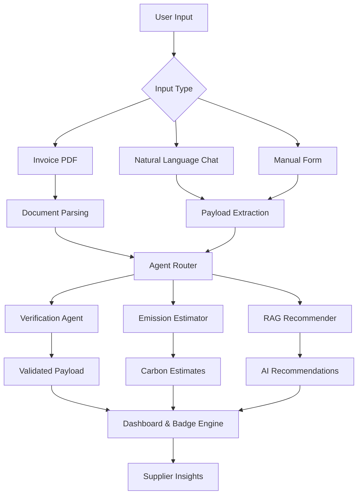
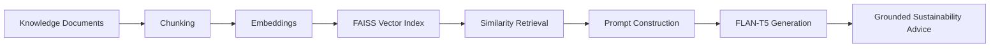

# 🌱 SparkScope — AI-Powered Supplier Sustainability & Emission Intelligence Platform

> Built for Walmart Sparkathon to help suppliers estimate carbon emissions and receive grounded AI recommendations for reduction.


---

## 📽 Demo

🎥 **Watch Demo:**  
https://www.youtube.com/watch?v=AowVcYrim-c

---

# Problem Statement

Supplier sustainability reporting is often:

- Spreadsheet-heavy
- Difficult to verify
- Fragmented across workflows
- Lacking actionable guidance

Many suppliers struggle to estimate emissions or understand how to reduce them.

**SparkScope** addresses this through an AI-assisted onboarding and emission intelligence workflow.

---

# What SparkScope Does

SparkScope enables suppliers to:

### 📄 Upload Invoices
Extract activity information directly from PDF invoices.

### 💬 Use Natural Language
Describe activities conversationally.

Example:

> "I used 5000 kWh and shipped 12 pallets over 520 km"

### 📝 Manual Fallback Input
Supports structured form-based submission.

### 🌍 Estimate Carbon Emissions
Computes emissions using **DEFRA emission factors**.

### 🛡 Verify Input Quality
Detects suspicious or unusual activity values.

### 🏅 Assign Sustainability Badges
Provides badge-based sustainability scoring.

### 💡 Generate AI Recommendations
Uses **Retrieval-Augmented Generation (RAG)** to produce grounded emission reduction strategies.

---

# 🏗 System Architecture



---

# Core Features

## 1. Multi-Modal Supplier Onboarding

SparkScope supports:

- PDF invoice extraction
- Conversational input
- Manual structured entry

This reduces spreadsheet dependency and improves accessibility.

---

## 2. Carbon Emission Estimation

Emissions are estimated using:

- DEFRA Carbon Factors dataset
- Category mapping logic
- Activity-specific emission factors

Example:

```json
{
  "electricity_kwh": 5000,
  "road_freight_tkm": 6240
}
```

↓

```json
{
  "electricity_kwh": 1030.0,
  "road_freight_tkm": 842.1,
  "total": 1872.1
}
```

---

## 3. Verification Agent

SparkScope validates incoming payloads and flags:

- Negative values
- Zero-value anomalies
- Unusually high emissions

Example:

> ⚠ Electricity usage appears unusually high.

This improves reporting reliability.

---

## 4. RAG-Powered Sustainability Recommendations

SparkScope does **not** generate generic AI advice.

Recommendations are grounded using:

- Custom sustainability knowledge base
- FAISS vector search
- HuggingFace embeddings
- LangChain retrieval
- Local FLAN-T5 generation

### Recommendation Pipeline



Example:

Input:

> "How do I reduce transport emissions?"

Output:

- Optimize route planning
- Consolidate shipments
- Adopt lower-emission logistics

---

# Tech Stack

| Layer | Technology |
|---|---|
| Frontend | Streamlit |
| Backend | FastAPI |
| AI / RAG | LangChain + FAISS |
| Embeddings | all-MiniLM-L6-v2 |
| Local LLM | FLAN-T5 |
| PDF Parsing | PyMuPDF / PDFMiner |
| Dataset | DEFRA Carbon Factors |
| Language | Python |

---

# Repository Structure

```text
SparkScope/
│
├── backend/
│   ├── agents/
│   │   ├── document_ingestion/
│   │   ├── estimator/
│   │   ├── recommender/
│   │   ├── verification/
│   │   └── agent_router.py
│   │
│   ├── api/
│   ├── data/
│   └── faiss_index/
│
├── frontend/
├── recommender_data/
├── docs/
└── requirements.txt
```

---

# ⚙ Local Setup

## 1. Install Dependencies

```bash
pip install -r requirements.txt
```

Python 3.10+ recommended.

---

## 2. Build FAISS Index

```bash
python backend/agents/recommender/rag_build_index.py
```

---

## 3. Start FastAPI Backend

```bash
uvicorn backend.api.main:app --reload
```

---

## 4. Launch Streamlit Frontend

```bash
streamlit run frontend/streamlit_app.py
```

---

# Engineering Challenges

During development we tackled:

- Extracting structured activity data from invoices
- Handling ambiguous natural-language input
- Grounding recommendations using retrieval
- Validating unreliable supplier payloads
- Integrating modular agents cleanly

---

# Impact

SparkScope helps suppliers:

✅ Estimate emissions  
✅ Understand sustainability performance  
✅ Receive grounded reduction strategies  
✅ Participate effectively in carbon reporting initiatives  

This aligns with **Walmart Project Gigaton™** goals.

---

# Team Phoenix

Built with ❤️ for Walmart Sparkathon.
